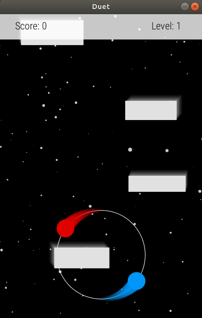

# Duet

## Introduction
[Duet](https://play.google.com/store/apps/details?id=com.kumobius.android.duet) is a great fun mobile arcade game developed by [Kumobius](http://www.kumobius.com/). The idea behind the game is to avoid different obstacles coming at you with different speeds and angles while enjoying the wonderful [music](https://timshiel.bandcamp.com/album/duet-original-soundtrack) composed by [Tim Shiel](https://soundcloud.com/timshiel). The player can only rotate the two dots right and left to avoid the obstacles. Very challenging, fun and addicting. I got inspired, and decided to implement a similar game using Processing 3 for PC.

## How to Play
The game is very simple: press `RIGHT` button to rotate the dots to the right and `LEFT` to rotate them to the left. However, the player has to be smart about decisions, focused, and forward looking. Hence comes the game motto: ***You have to maintain a circular state of mind!***

## Features
- Infinite number of levels, with every level, the game gets faster and more challenging.
- Simple and beautifully designed and animated game environment.
- All the beautiful original soundtracks of the mobile game.
- Ability to save screenshots of the your high scores to share with friends and challenge them!

## Requirements
Alright enough marketing! I started this project in an attempt to create an easily done replica of a beautiful game in `Processing3` that hasn't already been implemented by someone in openprocessing.org community (God! those guys replicated almost every famous addictive game using `Processing3`!). At the same time, I hope that whoever stumbles upon this can learn a thing or two. I myself am not an expert in `Processing3`, but I learned some tricks.
- [Download Processing3](https://processing.org/download)
- Open `Duet.pde` with `Processing3 IDE`
- Click on `Run` and enjoy the game!
- No hardware requirements (well, other than a PC with a keyboard and a monitor, duh!). Your potato-PC is surely capable of handling the game's fantastic graphics!

## Screenshots
### Start

### Gameplay
 
### Game Over

## Music Copyrights
[Tim Shiel](soundcloud.com/timshiel) composed this magnificent music for [Duet](https://play.google.com/store/apps/details?id=com.kumobius.android.duet) game. All copyrights are reserved to him only. You should [buy](https://timshiel.bandcamp.com/album/duet-original-soundtrack) your own copy of the album if you like it.
